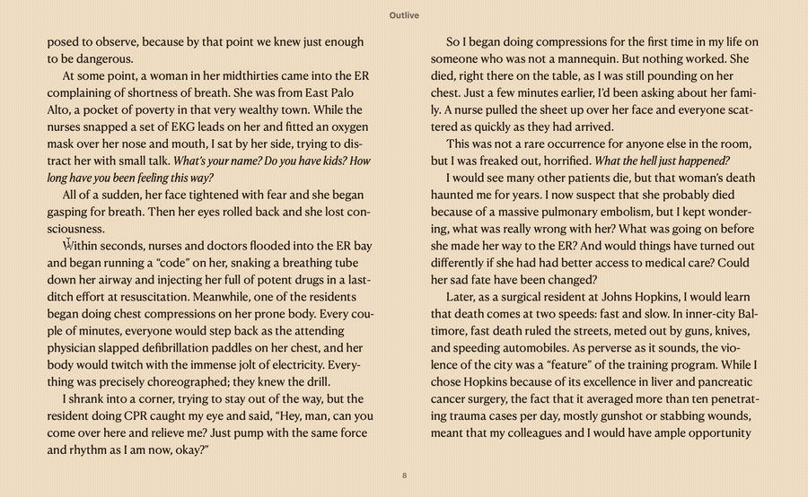

# ELTA — 英语精读翻译助手（划词/截图）

ELTA 是一款专为英语精读设计的 macOS 菜单栏翻译工具。框选、划词或鼠标悬停，一键 OCR 识别 + AI 翻译，菜单栏常驻，随时唤醒。



**官网：** [autoelta.com](https://autoelta.com/)（备用：elta-seven.vercel.app）

## 核心功能

- **框选截图翻译** — 在屏幕任意位置框选区域，自动 OCR + AI 翻译
- **划词翻译** — 选中文本，按快捷键直接翻译，跳过截图步骤
- **悬停翻译** — 鼠标移到段落右下角，按快捷键翻译鼠标上方半屏内容（内容范围可选「双栏 / 整栏」，自动分段，免截图/划词）
- **本地 OCR** — 基于 Apple Vision 框架的离线文字识别
- **多 AI 后端** — 支持 DeepSeek、OpenAI、Anthropic Claude、Google Gemini、千问、Ollama 等
- **自定义模板** — 自由编辑翻译提示词，适配不同场景
- **全局快捷键** — `Cmd+T` 截图翻译，`⇧⌘T` 划词翻译，`⌥⌘T` 悬停翻译

## 技术栈

| 层级 | 技术 |
|------|------|
| 语言 | Swift |
| UI 框架 | Cocoa / AppKit |
| OCR | Apple Vision |
| 快捷键 | Carbon |
| 架构 | Universal Binary (Intel + Apple Silicon) |
| 前端 | HTML / CSS / JavaScript (Vanilla) |
| 后端 | Vercel Serverless Functions |
| 数据 | Supabase (PostgreSQL + Storage) |

## 系统要求

- macOS 13.0+
- Intel 或 Apple Silicon

## 快速开始

1. 从 [官网](https://autoelta.com/) 下载最新 DMG
2. 将 ELTA.app 拖入 `/Applications/`
3. 首次启动后，打开菜单栏 ELTA 图标 → 设置 → 配置 AI 后端和 API Key
4. 按 `Cmd+T` 截图翻译，`⇧⌘T` 划词翻译，或 `⌥⌘T` 悬停翻译

## 本地开发

```bash
# 编译 macOS 客户端
./build.sh

# 前端开发（直接打开 HTML 文件即可）
# 或使用任意静态服务器
```

## 反馈与贡献

- 🐛 遇到 Bug 或有功能建议？[提交 Issue](https://github.com/liuxiaominglove/elta/issues)
- 💻 想贡献代码？查看 [贡献指南](CONTRIBUTING.md)

## 许可证

[ISC License](LICENSE) — 简短、宽松的开源许可证。
